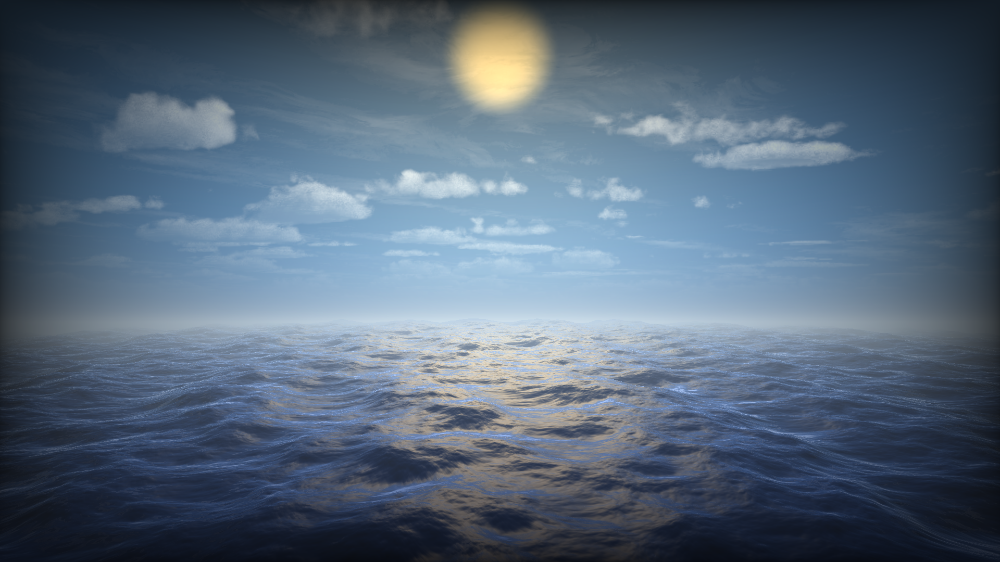
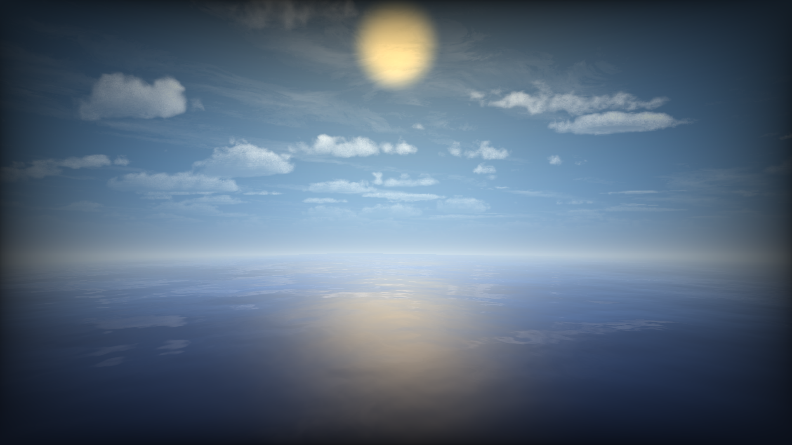

# Water-Raymarching-Simulation
- Water-Raymarching-Simulation is a real-time water effect using OpenGL and ray marching. The simulation renders a fullscreen quad, with a fragment shader that creates waves by combining Sum of Sines functions and Fractal Brownian Motion (FBM). Analytical normals are used for accurate lighting, which includes cubemap reflections, Fresnel effects, and Phong shading. Sun and vignette effects add realism to the scene.
## Demo Video

Check out the demo video [here](./D-Engine/Recordings/WaterSkyBox2.mp4).

Check out the demo video [here](./D-Engine/Recordings/WaterSkyBox.mp4).

